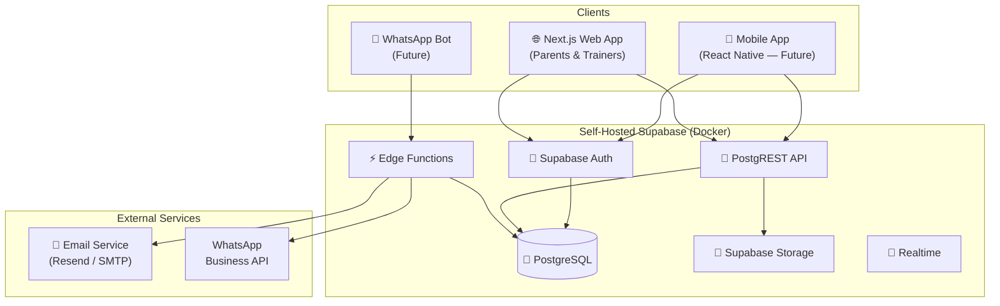
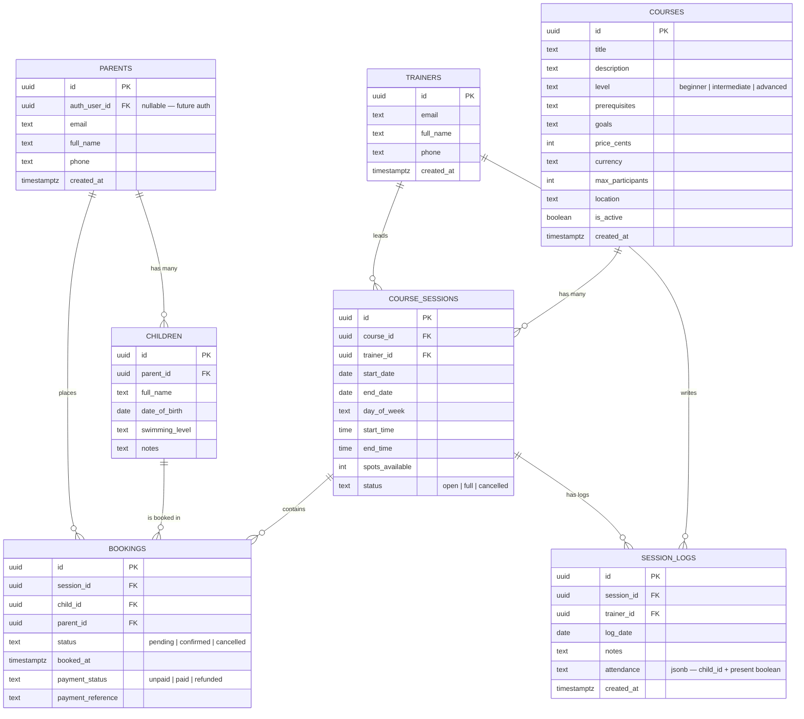
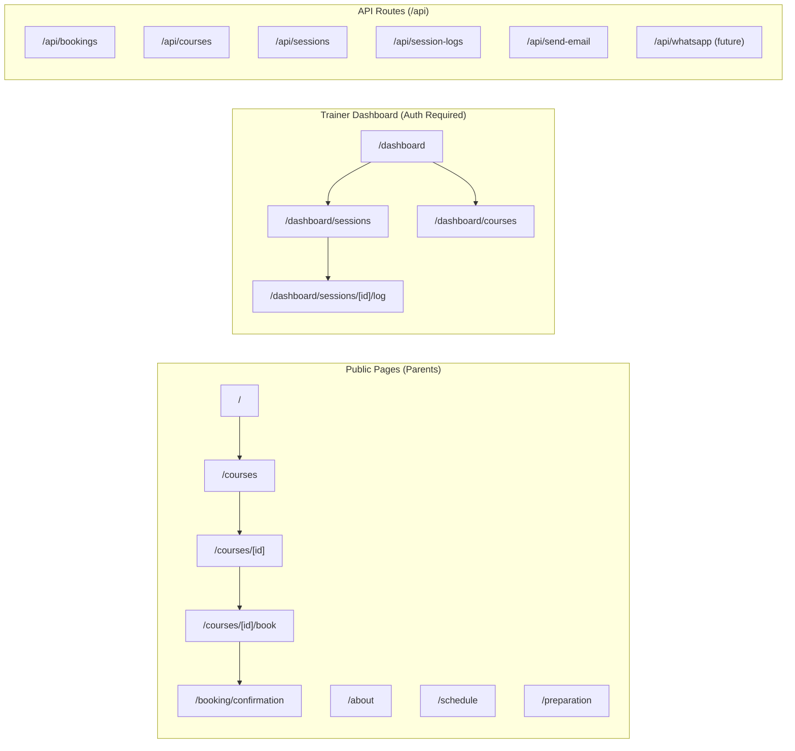
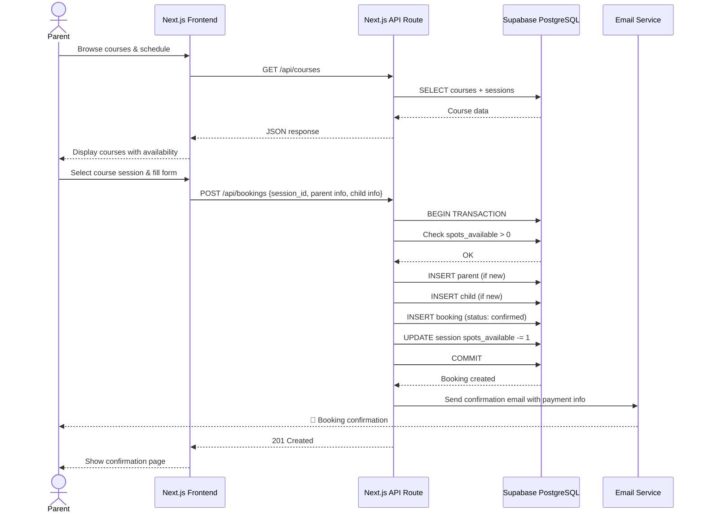
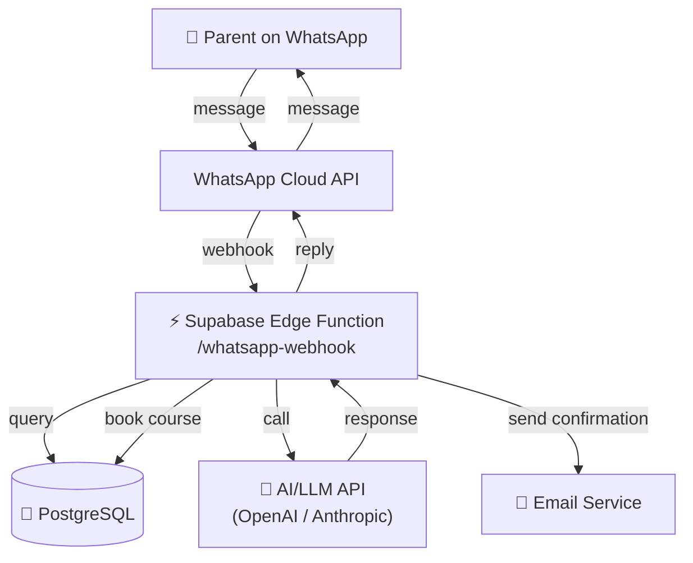
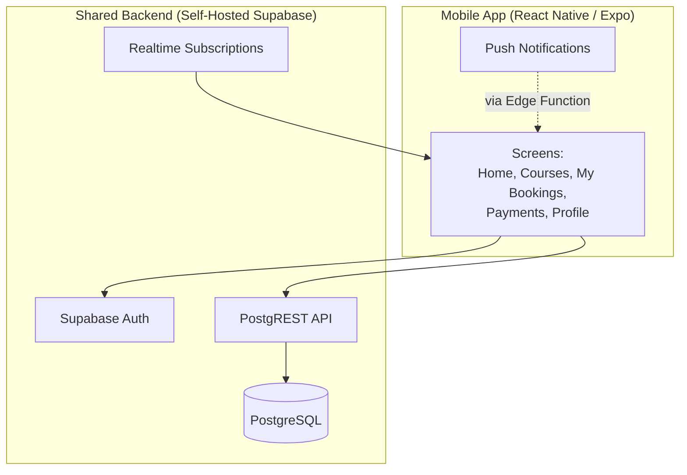

# Implementation Plan: Otterly Fun Swim School

## 1. Tech Stack Overview

| Layer | Technology | Notes |
|---|---|---|
| **Frontend** | Next.js 14 (App Router) | React-based, SSR/SSG, TypeScript |
| **Styling** | Tailwind CSS | Utility-first, responsive design |
| **Backend / API** | Next.js Route Handlers + Supabase | REST API via route handlers; Supabase for auth, DB, storage |
| **Database** | PostgreSQL (via self-hosted Supabase) | Relational, Row Level Security (RLS) |
| **Authentication** | Supabase Auth | Email/password for trainers; magic-link or OAuth for parents (future) |
| **Email** | Supabase Edge Functions + Resend (or SMTP) | Transactional emails for booking confirmations |
| **Hosting** | Docker Compose (self-hosted Supabase) + Vercel or VPS for Next.js | Supabase stack on VPS; Next.js deployed separately |
| **Future: WhatsApp Bot** | Supabase Edge Functions + WhatsApp Business API | Stateless functions hitting shared DB |
| **Future: Mobile App** | React Native (Expo) | Shares API layer with web |

---

## 2. Architecture Diagrams

### 2.1 High-Level System Architecture



### 2.2 Database Schema (ERD)



### 2.3 Next.js Page / Route Structure



### 2.4 Booking Flow (Sequence Diagram)



### 2.5 Future: WhatsApp Bot Architecture



### 2.6 Future: Mobile App Architecture



---

## 3. Implementation Phases

### Phase 1 — Foundation & Information Pages
**Goal:** Get the website live with static content and course information.

| Task | Details |
|---|---|
| Set up Next.js project | App Router, TypeScript, Tailwind CSS, ESLint |
| Self-host Supabase | Docker Compose on VPS, configure PostgreSQL, Auth, Storage |
| Create database schema | Courses, course_sessions, trainers tables + seed data |
| Build public pages | Home, About/Location, Courses listing, Course detail, Preparation tips |
| Responsive design | Mobile-first layout with Tailwind |
| SEO & metadata | Open Graph tags, structured data for local business |

### Phase 2 — Booking System & Email
**Goal:** Parents can book courses and receive confirmation emails.

| Task | Details |
|---|---|
| Extend schema | Add parents, children, bookings tables |
| Build booking flow | Booking form on course page → API route → DB insert |
| Availability logic | Real-time spot tracking, disable booking when full |
| Email integration | Set up Resend or SMTP; send confirmation with payment info |
| Booking confirmation page | Thank-you page with summary and next steps |
| Input validation | Zod schemas for all form inputs |

### Phase 3 — Trainer Dashboard
**Goal:** Trainers can log in, view sessions, and keep training logs.

| Task | Details |
|---|---|
| Supabase Auth setup | Email/password login for trainers |
| Trainer dashboard layout | Protected routes with middleware |
| Session management | View upcoming & past sessions |
| Session logs | Create/edit logs per session (notes, attendance tracking) |
| Course management | CRUD operations for courses and sessions |
| Row Level Security | RLS policies so trainers only access their own data |

### Phase 4 — AI-Powered WhatsApp Bot (Future)
**Goal:** Parents can interact with the swim school via WhatsApp.

| Task | Details |
|---|---|
| WhatsApp Business API setup | Register number, configure webhook |
| Supabase Edge Function | Webhook handler for incoming messages |
| AI integration | Connect to LLM for natural language understanding |
| Intent handling | Answer FAQs, check availability, make bookings |
| Conversation state | Track multi-turn conversations in DB |
| Testing & moderation | Safety guardrails, fallback to human support |

### Phase 5 — Mobile App (Future)
**Goal:** Parents manage bookings and interact with the school on mobile.

| Task | Details |
|---|---|
| Expo / React Native setup | Shared API layer with web |
| Authentication | Supabase Auth with secure token storage |
| Core screens | Home, Courses, My Bookings, Payments, Profile |
| Push notifications | Course reminders, booking confirmations |
| Realtime updates | Live availability via Supabase Realtime |

---

## 4. Project Structure

```
otterly-fun/
├── src/
│   ├── app/                        # Next.js App Router
│   │   ├── (public)/               # Public route group
│   │   │   ├── page.tsx            # Home
│   │   │   ├── about/page.tsx
│   │   │   ├── courses/
│   │   │   │   ├── page.tsx        # Course listing
│   │   │   │   └── [id]/
│   │   │   │       ├── page.tsx    # Course detail
│   │   │   │       └── book/page.tsx
│   │   │   ├── schedule/page.tsx
│   │   │   ├── preparation/page.tsx
│   │   │   └── booking/
│   │   │       └── confirmation/page.tsx
│   │   ├── dashboard/              # Trainer (protected)
│   │   │   ├── page.tsx
│   │   │   ├── sessions/
│   │   │   │   ├── page.tsx
│   │   │   │   └── [id]/log/page.tsx
│   │   │   └── courses/page.tsx
│   │   ├── api/
│   │   │   ├── bookings/route.ts
│   │   │   ├── courses/route.ts
│   │   │   ├── sessions/route.ts
│   │   │   ├── session-logs/route.ts
│   │   │   └── send-email/route.ts
│   │   └── layout.tsx
│   ├── components/
│   │   ├── ui/                     # Reusable UI components
│   │   ├── courses/                # Course-specific components
│   │   ├── booking/                # Booking form components
│   │   └── dashboard/              # Trainer dashboard components
│   ├── lib/
│   │   ├── supabase/
│   │   │   ├── client.ts           # Browser Supabase client
│   │   │   ├── server.ts           # Server Supabase client
│   │   │   └── admin.ts            # Service-role client
│   │   ├── email.ts                # Email sending utility
│   │   └── validations.ts          # Zod schemas
│   ├── types/
│   │   └── database.ts             # Generated Supabase types
│   └── styles/
│       └── globals.css
├── supabase/
│   ├── docker-compose.yml          # Self-hosted Supabase
│   ├── migrations/                 # SQL migration files
│   │   ├── 001_create_trainers.sql
│   │   ├── 002_create_courses.sql
│   │   ├── 003_create_sessions.sql
│   │   ├── 004_create_parents_children.sql
│   │   ├── 005_create_bookings.sql
│   │   └── 006_create_session_logs.sql
│   ├── seed.sql                    # Initial seed data
│   └── config.toml
├── public/
│   └── images/
├── .env.local
├── next.config.ts
├── tailwind.config.ts
├── tsconfig.json
├── package.json
└── README.md
```

---

## 5. Key Technical Decisions

### Why Self-Hosted Supabase?
- Full control over data and infrastructure (important for handling children's data).
- No vendor lock-in; can scale independently.
- Cost-effective at scale compared to Supabase Cloud.
- Edge Functions run locally, ideal for future WhatsApp bot webhook handling.

### Why Next.js App Router?
- Server components reduce client-side JavaScript for fast page loads.
- Built-in API routes keep the backend co-located with the frontend.
- SSR for SEO-critical pages (courses, schedules).
- Easy to add authentication middleware for the trainer dashboard.

### Future-Proof API Design
- All data access goes through Supabase PostgREST or Next.js API routes.
- The same API layer will serve the mobile app and WhatsApp bot — no duplication.
- Row Level Security ensures consistent authorization regardless of client.

### Database Design for Extensibility
- `parents` table has an optional `auth_user_id` — no auth required now, ready for login later.
- `session_logs` with JSON attendance enables flexible tracking without schema changes.
- All tables use UUIDs as primary keys for easy cross-system integration.

---

## 6. Environment & Deployment

```
# .env.local (example)
NEXT_PUBLIC_SUPABASE_URL=https://supabase.yourdomain.com
NEXT_PUBLIC_SUPABASE_ANON_KEY=your-anon-key
SUPABASE_SERVICE_ROLE_KEY=your-service-role-key
RESEND_API_KEY=your-resend-api-key
```

| Component | Deployment |
|---|---|
| Supabase (Postgres, Auth, PostgREST, Edge Functions) | Docker Compose on VPS (e.g., Hetzner, DigitalOcean) |
| Next.js | Vercel (easiest) or self-hosted on same/different VPS |
| Domain & SSL | Caddy or Nginx reverse proxy with Let's Encrypt |
| CI/CD | GitHub Actions — lint, test, deploy on push to main |

---

## 7. Non-Functional Requirements

- **Performance:** Lighthouse score > 90 on all public pages.
- **Accessibility:** WCAG 2.1 AA compliance.
- **Security:** RLS on all tables, input validation with Zod, CSRF protection.
- **Privacy:** GDPR-aware — minimal data collection, parental consent flows.
- **Monitoring:** Basic uptime monitoring and error tracking (e.g., Sentry).
- **Backups:** Automated PostgreSQL backups via cron on VPS.
